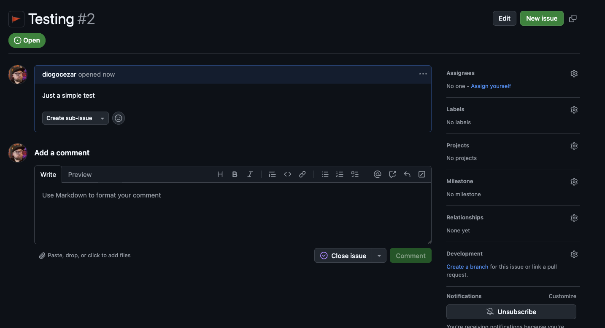
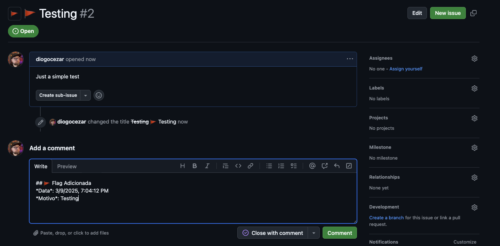

# GitHub Issue Flag Toggle

Uma extensão para o Chrome que permite adicionar ou remover flags (🚩) dos títulos das issues do GitHub com um simples clique.

## Funcionalidades

- Adiciona um botão 🚩 ao lado do botão "Edit" nas páginas de issues do GitHub
- Ao clicar no botão, adiciona ou remove uma flag (🚩) no início do título da issue
- Quando uma flag é adicionada, também insere automaticamente um comentário com um template para explicar o motivo da flag

## Como instalar

1. Clone este repositório ou baixe os arquivos
2. Abra o Chrome e navegue até `chrome://extensions/`
3. Ative o "Modo do desenvolvedor" no canto superior direito
4. Clique em "Carregar sem compactação" e selecione a pasta deste projeto
5. A extensão será instalada e estará pronta para uso

## Como usar

1. Navegue até qualquer página de issue do GitHub
2. Você verá um novo botão 🚩 ao lado do título da issue
3. Clique neste botão para adicionar uma flag ao título da issue
4. Se o título já tiver uma flag, clicar no botão irá removê-la
5. Quando uma flag é adicionada, um comentário será automaticamente inserido com a data e hora, e você poderá preencher o motivo

## Screenshots

### Botão de flag ao lado do botão de edição

### Comentário automático ao adicionar uma flag

## Observações

- A extensão funciona apenas em páginas de issues do GitHub
- É necessário ter permissão para editar a issue para que a funcionalidade funcione corretamente
- A interface do GitHub pode mudar com o tempo, o que pode afetar o funcionamento da extensão
- Se você encontrar problemas, verifique se há atualizações disponíveis para a extensão